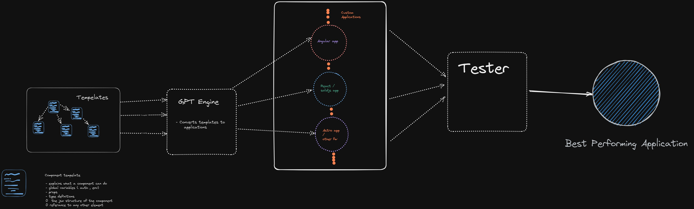
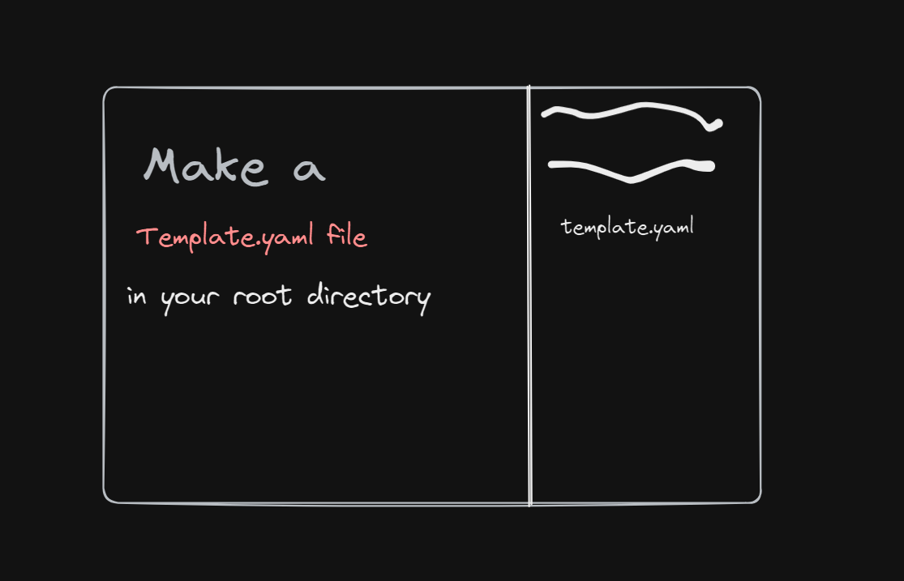
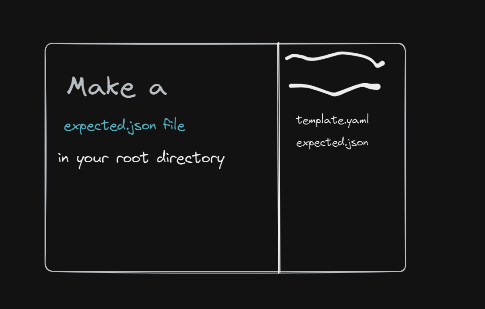
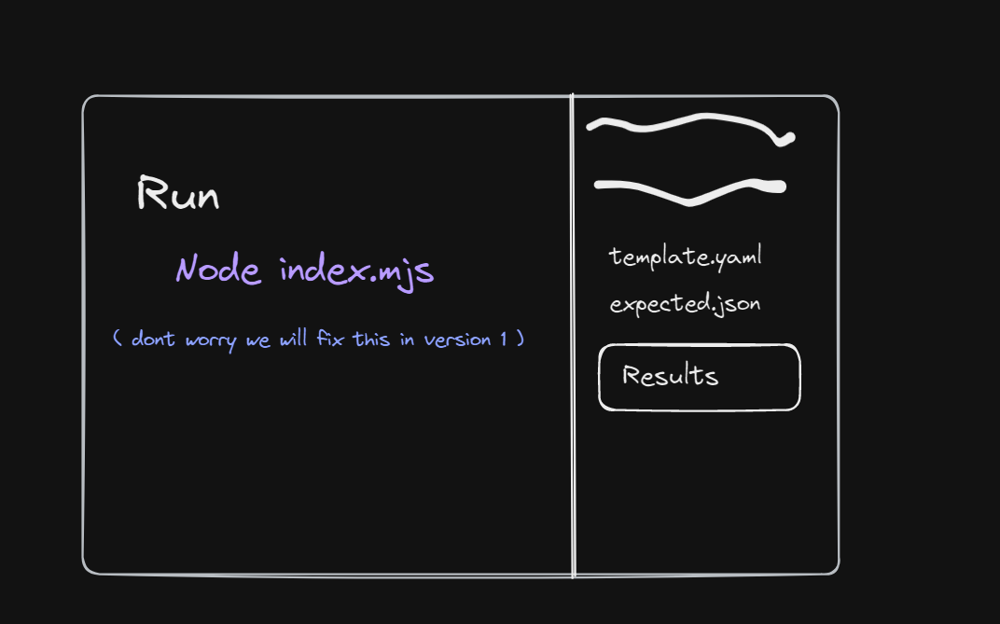

<h1 align="center">Tempelate Writer Every Language </h1>

### Simple Javascript  component creator based on template provided using OpenAI's GPT-3. 

---





---

<details>
<summary>Why we need this </summary>
    1. there are many different frameworks with many different  ways to incorporate javascript in frameworks. A team should not focus on different frameworks instead go with what works best for them and passes the most tests. 
   
    2. Writing the same component in 15 different framworks is tedious and repetitive , something GPT can do if you can provide explicit details. 
   

</details>

<h1 align="center">Documentation </h1>

### 1.  provide a ```tempelate.yaml``` file with respective tempelate , check [here](./tempelate.yaml) to what a default tempelate should look like . the file should be in the root directory of the project , (sorry later we will make a dedicated folder)



2. Another Optional file is ```expected.json``` also in root directory  ,  this is so that we can focus on the framworks that you want . here is another [example](./expected.json) of how an expected.json should look like . 



3. Run  ``` node index.mjs``` and  look out for `/results` folder . this project is  still in beta , wait till we release version 1.0.0.  
 

---